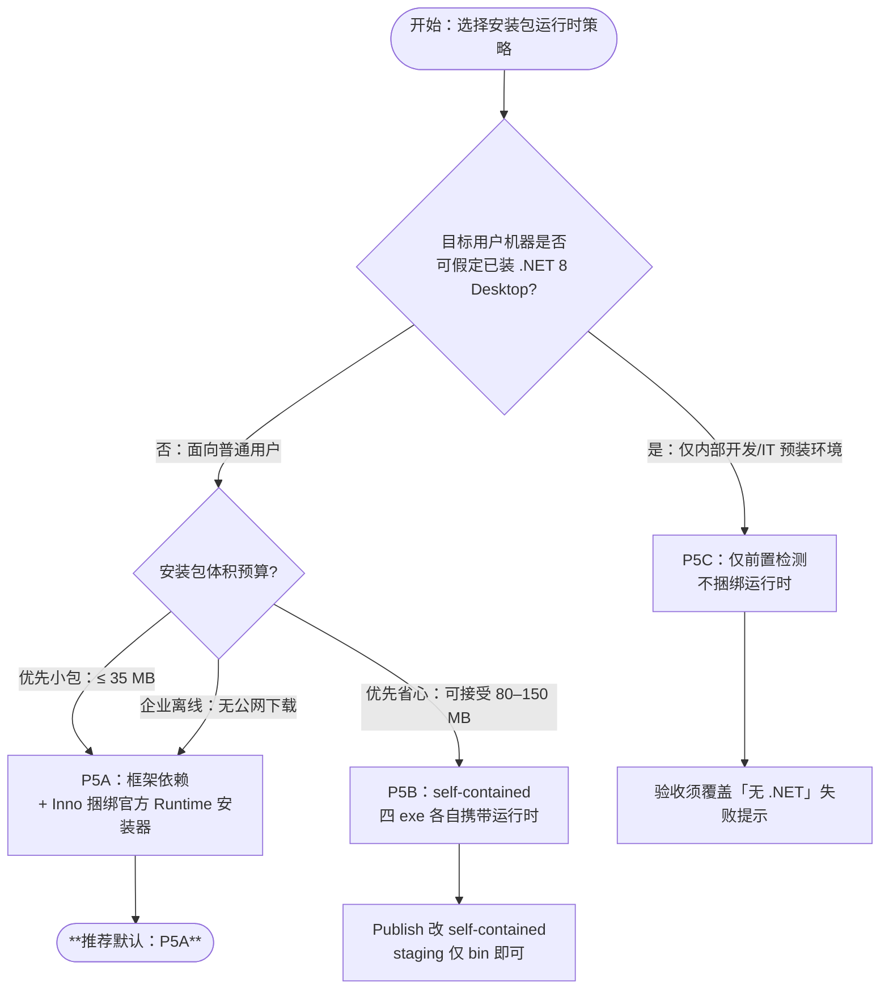

# Inno Setup 安装包 Task Contract — SmartGuard 应用安装版

**状态：** **决策已签署** — 待批准实施后执行  
**签署日期：** 2026-06-16（H1–H6，见 §十二）
**父规划：** [`MIGRATION.md`](MIGRATION.md) § Phase 5  
**制定日期：** 2026-06-16  
**前置：** Phase 4 已完成；生产态为 C# 四件套 + `Engine.exe --install`（C# `ScheduledTaskRegistrar`，Phase 6.1）

---

## Execution Summary

| 项 | 内容 |
|----|------|
| **Task** | 为 SmartGuard 提供 Windows 安装版：Inno Setup 打包、安装/卸载向导、计划任务注册、可选 .NET 8 运行时处理 |
| **Mode** | `STANDARD`（首版以可重复构建与手动验收为主；签名与 CI 可后置） |
| **推荐顺序** | **5.0 运行时策略决策** → **5.1 构建暂存目录** → **5.2 `.iss` + 编译** → **5.3 安装验收** → **5.4（可选）代码签名 / CI** |
| **默认运行时策略** | **P5A**（已签署，见 §3.3、§十二） |
| **Status** | **5.1–5.2 已实施**；Phase 6 载荷已去 PS；Build-Staging 发布链见 Phase 7.5（`build.cmd`） |

---

## Task Contract Summary

| 项 | 内容 |
|----|------|
| **Goal** | 终端用户通过安装向导完成部署：释放文件 → 注册计划任务 → 可选启动托盘；卸载时移除任务并保留或可选删除用户数据 |
| **In scope** | `installer/` 目录（`.iss`、构建脚本、暂存布局）；Release 构建产物打包；`--install` / `--uninstall` 集成；`.NET 8` 运行时策略二选一；安装版文件清单与验收表 |
| **Out of scope** | ~~将 `schtasks` 注册迁出 PowerShell~~（**Phase 6.1 已完成**）；MSI/WiX；Windows Store；自动更新通道；多语言安装向导（首版仅 zh-CN 文案即可） |
| **Acceptance** | §八验收表 V1–V8 全过；干净 VM 上安装成功；升级不覆盖用户 `config`/`log`；卸载后计划任务消失 |
| **Rollback** | 卸载向导执行 `--uninstall`；用户数据默认保留；回退到「zip + 手动 Publish + `--install`」流程不变 |

---

## Risk Note

| 焦点 | 说明 | 缓解 |
|------|------|------|
| **安装仍调 PS 注册脚本** | ~~`Engine.exe --install` 依赖 `Register-*.ps1`~~ | **Phase 6.1 已废止**；`ScheduledTaskRegistrar` 纯 C# |
| **UAC / 最高权限任务** | Guardian 任务 `RunLevel Highest` | Inno `[Run]` 段 `runascurrentuser` + `runasadmin`；失败时写 `SmartGuard.startup.log` |
| **.NET 8 缺失** | `build.cmd` / `Directory.Build.props` 为 `--self-contained false` | 采用 §二决策树默认 **P5A** 或显式选 **P5B** |
| **配置覆盖** | `SmartGuard.config.json` 在安装根目录 | 升级安装使用 `onlyifdoesntexist` 或 `[InstallDelete]` 排除 |
| **遗留安装入口** | `Register-Task.cmd` / `Setup-All.cmd` 仅注册 PS | **禁止**打入安装包；文档与 README 标明废弃 |
| **未签名 exe** | SmartScreen 可能拦截 | 验收记录警告；P5.4 可选 Authenticode |

---

## 一、Goal（Phase 5 总目标）

1. **一键安装：** 用户运行 `SmartGuard-Setup-x64.exe` 即可完成文件部署与计划任务注册。
2. **路径契约不变：** `--root` 指向**安装根目录** `{app}`（含 `bin\`、`lib\`、config/status/log），与开发机 `D:\Project\SmartGuard` 布局同构。
3. **与现网安装命令等价：** 安装后效果 ≈ `Publish-All` + `Engine.exe --root "{app}" --install` + 启动托盘。
4. **可重复构建：** 单一构建脚本从仓库生成 `dist\SmartGuard-Setup-{version}-x64.exe`。
5. **可回滚：** 卸载 ≠ 删用户日志/配置（默认）；计划任务必须移除。

---

## 二、Non-Goals（整个 Phase 5 不做）

| 项 | 说明 |
|----|------|
| 重写 `InstallCommands` 为纯 C# schtasks | **Phase 6.1 已完成**；安装包已去掉 `Register-*.ps1`（Phase 6.4） |
| 打包全套 `lib\layers\` PS 回退 | 安装版默认 **仅 C# 路径**；回退脚本不作为默认组件 |
| 将配置迁到 `%AppData%` | 保持安装目录内 `SmartGuard.config.json` |
| Linux / macOS 安装器 | 仅 Windows 10/11 x64 |
| 自动检查更新 | 不做 |
| 修改引擎/托盘业务逻辑 | 除非验收暴露安装路径硬编码 bug |

---

## 三、运行时策略决策树（self-contained vs runtime 捆绑）

### 3.1 决策流程



### 3.2 策略对照表

| 代号 | 发布参数 | 安装包内容 | 预估体积 | 优点 | 缺点 |
|------|----------|------------|----------|------|------|
| **P5A（推荐）** | `--self-contained false` | `bin\` + 资源 + **内嵌** `windowsdesktop-runtime-8.0.x-win-x64.exe` | ~35–45 MB（含 runtime 引导） | 体积较小；与 `build.cmd` 一致 | 需处理 runtime 静默安装与版本钉扎 |
| **P5B** | `--self-contained true`（四项目） | `bin\`（膨胀）+ 资源 | ~80–150 MB | 目标机零依赖 .NET | 体积大；四 exe 共享运行时重复（可后续做单 host 优化，**非本阶段**） |
| **P5C** | `--self-contained false` | 同 P5A 但不内嵌 runtime；`[Code]` 仅检测 | ~5–10 MB | 最小包 | 普通用户易装失败；**不推荐对外发布** |

### 3.3 冻结决策（已签署 2026-06-16）

| 决策项 | 签署值 |
|--------|--------|
| **运行时策略** | **P5A**（框架依赖 + 捆绑 .NET 8 Desktop Runtime x64） |
| **Runtime 版本钉扎** | `.NET 8.0.x` Desktop Runtime **x64** |
| **P5B 触发条件** | 仅当 P5A 在干净 VM 验收失败且企业策略禁止捆绑引导安装时启用 |
| **架构** | 仅 `win-x64` |
| **安装路径** | 默认 `{autopf}\SmartGuard`；**允许用户在向导中自定义**（不禁用目录页） |
| **发布者** | `AppPublisher=rainiva`；`AppPublisherURL=https://github.com/rainiva/SmartGuard` |
| **许可协议** | 首版使用 `installer\license_zh-CN.txt` 简易占位文本 |
| **卸载用户数据** | 默认**保留** config/log；卸载向导提供勾选项，用户可选删除 |
| **桌面快捷方式** | 可选 Task，**默认不勾选** |
| **代码签名** | 首版不强制；`AppPublisher` 已填，证书主体与 rainiva 对齐（P5.4 可选） |

### 3.4 P5A：Runtime 检测与安装（Inno `[Code]` 职责）

检测逻辑（示意，实施时写入 `.iss` `[Code]` 段）：

1. 读注册表 `HKLM\SOFTWARE\dotnet\Setup\InstalledVersions\x64\sharedhost` 或调用 `dotnet --list-runtimes`（若 PATH 可用）。
2. 确认存在 `Microsoft.WindowsDesktop.App 8.0.x`。
3. 若缺失：从 `{tmp}` 运行内嵌的 `windowsdesktop-runtime-8.0.*-win-x64.exe`  
   参数建议：`/install /quiet /norestart`（以微软官方文档为准，实施时 **Official Docs Check** 核对静默开关）。
4. 安装失败 → 中止并提示用户手动安装 Desktop Runtime 链接。

### 3.5 P5B：Publish 变体（构建脚本职责）

```powershell
# 变体：installer\Build-Staging.ps1 内切换
dotnet publish $project -c Release -r win-x64 --self-contained true -o $staging\bin
```

四件套均 self-contained；**不再**需要 `redist\` 目录；`[Code]` 中 .NET 检测可省略。

---

## 四、安装目录布局（`{app}` = 安装根 = `--root`）

```
{app}\
├── bin\
│   ├── SmartGuard.Engine.exe
│   ├── SmartGuard.Tray.exe
│   ├── SmartGuard.LogViewer.exe
│   ├── SmartGuard.Settings.exe
│   └── *.dll（依赖项）
├── lib\
│   ├── SmartGuard.ico
│   └── SmartGuard.Settings.xaml
├── SmartGuard.config.json          ← 首次 onlyifdoesntexist
├── SmartGuard.status.json          ← 可选：不打包，运行时生成
├── SmartGuard.log                  ← 不打包
└── SmartGuard.startup.log          ← 不打包
```

**禁止**打入：`Register-Task.cmd`、`Setup-All.cmd`、`lib\Deploy.cmd`、`lib\layers\`（默认）、`src\`、`Tests\`。

---

## 五、构建流水线（规划）

### 5.1 子阶段

| 子阶段 | 代号 | 交付物 |
|--------|------|--------|
| **5.0** | 5I-decide | 签署 §3.3 运行时策略（P5A/P5B） |
| **5.1** | 5I-stage | `installer\Build-Staging.ps1` → `installer\staging\` |
| **5.2** | 5I-inno | `installer\SmartGuard.iss` + `ISCC.exe` → `dist\` |
| **5.3** | 5I-verify | 干净 VM 验收 §八 |
| **5.4** | 5I-sign | （可选）Authenticode 签名 Setup.exe 与 bin exe |

### 5.2 `Build-Staging.ps1` 步骤（契约）

```text
1. build.cmd（或 powershell -File scripts\Publish-All.ps1 -Configuration Release）
2. powershell -File lib\Create-TrayIcon.ps1（若 ico 不存在）
3. 复制 §四 清单 → installer\staging\（含已提交的 lib\SmartGuard.Settings.xaml）
4. [P5A] 下载/校验 redist\windowsdesktop-runtime-8.0.*-win-x64.exe → staging\redist\
5. 复制 installer\license_zh-CN.txt → staging\（供 .iss LicenseFile 引用）
6. 写入 staging\VERSION.txt（来自 git describe 或固定 1.0.0）
7. 调用 ISCC installer\SmartGuard.iss /DStagingDir=...
```

### 5.3 版本号来源（冻结）

首版使用 `installer\version.txt` 或 Inno `#define MyAppVersion` 手工维护；**不**在本阶段改 csproj AssemblyVersion（避免牵动全仓库）。

---

## 六、Inno Setup 骨架（`installer\SmartGuard.iss`）

> **说明：** 以下为 **骨架**，占位符 `{#StagingDir}`、`{#MyAppVersion}` 由 `ISCC /D` 传入；`[Code]` 段 P5A runtime 检测为示意，实施前须对照微软官方静默安装文档核对。

```iss
; -- SmartGuard Inno Setup skeleton (Phase 5)
; Compile: ISCC.exe /DStagingDir=..\installer\staging /DMyAppVersion=1.0.0 SmartGuard.iss

#ifndef StagingDir
  #define StagingDir "staging"
#endif
#ifndef MyAppVersion
  #define MyAppVersion "1.0.0"
#endif

#define MyAppName "SmartGuard"
#define MyAppPublisher "rainiva"
#define MyAppURL "https://github.com/rainiva/SmartGuard"
#define MyAppExeName "SmartGuard.Tray.exe"
#define EngineExe StagingDir + "\bin\SmartGuard.Engine.exe"

[Setup]
AppId={{A1B2C3D4-E5F6-7890-ABCD-EF1234567890}
AppName={#MyAppName}
AppVersion={#MyAppVersion}
AppPublisher={#MyAppPublisher}
AppPublisherURL={#MyAppURL}
DefaultDirName={autopf}\{#MyAppName}
DefaultGroupName={#MyAppName}
DisableProgramGroupPage=yes
; H2: 保留目录选择页，允许用户自定义 {app}
LicenseFile={#StagingDir}\license_zh-CN.txt
OutputDir=..\dist
OutputBaseFilename=SmartGuard-Setup-{#MyAppVersion}-x64
Compression=lzma2
SolidCompression=yes
WizardStyle=modern
PrivilegesRequired=lowest
ArchitecturesAllowed=x64compatible
ArchitecturesInstallIn64BitMode=x64compatible
UninstallDisplayIcon={app}\lib\SmartGuard.ico
; 安装后注册任务需提权 — 在 [Run] 使用 runasadmin

[Languages]
Name: "chinesesimplified"; MessagesFile: "compiler:Languages\ChineseSimplified.isl"

[Tasks]
Name: "desktopicon"; Description: "创建桌面快捷方式（托盘）"; GroupDescription: "附加图标:"; Flags: unchecked
Name: "launchtray"; Description: "安装完成后启动托盘"; GroupDescription: "安装后:"; Flags: checkedonce

[Files]
; 四件套 + DLL
Source: "{#StagingDir}\bin\*"; DestDir: "{app}\bin"; Flags: ignoreversion recursesubdirs createallsubdirs
; 资源
Source: "{#StagingDir}\lib\SmartGuard.ico"; DestDir: "{app}\lib"; Flags: ignoreversion
Source: "{#StagingDir}\lib\SmartGuard.Settings.xaml"; DestDir: "{app}\lib"; Flags: ignoreversion
; 计划任务：Setup [Run] 调用 Engine.exe --install（C# ScheduledTaskRegistrar）
; 默认配置 — 升级不覆盖；卸载删除由 H3 勾选项控制（见 [UninstallDelete]）
Source: "{#StagingDir}\SmartGuard.config.json"; DestDir: "{app}"; Flags: onlyifdoesntexist
; 许可协议占位
Source: "{#StagingDir}\license_zh-CN.txt"; DestDir: "{app}"; Flags: ignoreversion skipifsourcedoesntexist
; [P5A] .NET Desktop Runtime 引导包
Source: "{#StagingDir}\redist\windowsdesktop-runtime-8.0.*-win-x64.exe"; DestDir: "{tmp}"; Flags: deleteafterinstall; Check: ShouldInstallDotNet

[Icons]
Name: "{group}\{#MyAppName} 托盘"; Filename: "{app}\bin\{#MyAppExeName}"; Parameters: "--root ""{app}"""
Name: "{group}\{#MyAppName} 设置"; Filename: "{app}\bin\SmartGuard.Settings.exe"; Parameters: "--root ""{app}"""
Name: "{group}\{#MyAppName} 日志"; Filename: "{app}\bin\SmartGuard.LogViewer.exe"; Parameters: "--root ""{app}"""
Name: "{group}\卸载 {#MyAppName}"; Filename: "{uninstallexe}"
Name: "{autodesktop}\{#MyAppName}"; Filename: "{app}\bin\{#MyAppExeName}"; Parameters: "--root ""{app}"""; Tasks: desktopicon

[Run]
; [P5A] 静默安装 Desktop Runtime（若需要）
Filename: "{tmp}\windowsdesktop-runtime-8.0.0-win-x64.exe"; Parameters: "/install /quiet /norestart"; StatusMsg: "正在安装 .NET 8 桌面运行时..."; Check: ShouldInstallDotNet; Flags: waituntilterminated
; 注册计划任务（等同 Engine --install）
Filename: "{#EngineExe}"; Parameters: "--root ""{app}"" --install --skip-publish"; StatusMsg: "正在注册计划任务..."; Flags: runascurrentuser runasadmin waituntilterminated
; 可选启动托盘
Filename: "{app}\bin\{#MyAppExeName}"; Parameters: "--root ""{app}"""; Description: "启动 {#MyAppName} 托盘"; Flags: nowait postinstall skipifsilent; Tasks: launchtray

[UninstallRun]
Filename: "{#EngineExe}"; Parameters: "--root ""{app}"" --uninstall"; Flags: runascurrentuser runasadmin waituntilterminated

[UninstallDelete]
; H3: 仅当用户在卸载向导勾选「删除配置与日志」时执行（Check 见 [Code]）
Type: files; Name: "{app}\SmartGuard.config.json"; Check: ShouldDeleteUserData
Type: files; Name: "{app}\SmartGuard.log"; Check: ShouldDeleteUserData
Type: files; Name: "{app}\SmartGuard.startup.log"; Check: ShouldDeleteUserData
Type: files; Name: "{app}\SmartGuard.status.json"; Check: ShouldDeleteUserData

[Code]
var
  DeleteUserData: Boolean;

function ShouldDeleteUserData: Boolean;
begin
  Result := DeleteUserData;
end;

procedure DeleteDataCheckBoxClick(Sender: TObject);
begin
  DeleteUserData := TNewCheckBox(Sender).Checked;
end;

procedure InitializeUninstallProgressForm();
var
  DeleteDataCheckBox: TNewCheckBox;
begin
  DeleteUserData := False;
  DeleteDataCheckBox := TNewCheckBox.Create(UninstallProgressForm);
  DeleteDataCheckBox.Parent := UninstallProgressForm;
  DeleteDataCheckBox.Caption := '删除配置与日志文件（不可恢复）';
  DeleteDataCheckBox.Left := ScaleX(8);
  DeleteDataCheckBox.Top := UninstallProgressForm.ProgressBar.Top + ScaleY(24);
  DeleteDataCheckBox.Width := UninstallProgressForm.ClientWidth;
  DeleteDataCheckBox.OnClick := @DeleteDataCheckBoxClick;
end;

function IsDesktopDotNet8Installed: Boolean;
var
  ResultCode: Integer;
begin
  { 实施时：注册表检测 Microsoft.WindowsDesktop.App 8.0.x }
  { 占位：假定未安装以便骨架可编译；实施替换为真实检测 }
  Result := False;
end;

function ShouldInstallDotNet: Boolean;
begin
  { P5B self-contained 变体：恒返回 False }
  Result := not IsDesktopDotNet8Installed;
end;

function InitializeSetup: Boolean;
begin
  Result := True;
end;
```

### 6.1 骨架待实施项清单

| # | 项 | 说明 |
|---|-----|------|
| 1 | `AppId` GUID | 生成固定 GUID，升级安装共用 |
| 2 | `IsDesktopDotNet8Installed` | 实现真实检测；附单测或 VM 脚本 |
| 3 | Runtime 安装包文件名 | 与 `redist\` 实际版本对齐；避免 `*` 通配在生产 ISCC 失败 |
| 4 | `PrivilegesRequired` vs Guardian Highest | 验证 `lowest` + `runasadmin` `[Run]` 足够；不足则改 `admin` |
| 5 | 中文语言文件路径 | 依赖 Inno 安装目录 `ChineseSimplified.isl` |
| 6 | `--skip-publish` | 安装包已含 bin，**必须**传 `--skip-publish` 避免 UAC 下误报缺 exe |
| 7 | `license_zh-CN.txt` | 构建时复制到 staging；`LicenseFile` 指向 staging 副本 |
| 8 | H3 卸载复选框 | `InitializeUninstallProgressForm` + `[UninstallDelete]`；默认不删用户数据 |
| 9 | H2 自定义路径 | 不禁用目录页；验收 V9 |

---

## 七、Allowed / Forbidden Edit Scope（实施阶段）

### 7.1 Allowed

| 路径 | 用途 |
|------|------|
| `installer\SmartGuard.iss` | Inno 主脚本 |
| `installer\license_zh-CN.txt` | 许可协议占位（H5） |
| `installer\Build-Staging.ps1` | 暂存与编译入口 |
| `installer\staging\` | 构建输出（gitignore） |
| `installer\redist\` | .NET runtime 安装包（gitignore 或 LFS） |
| `dist\` | 最终 Setup.exe（gitignore） |
| `README.md` | 增加「安装版」章节 |
| `docs\MIGRATION.md` | Phase 5 状态更新 |
| `.gitignore` | 忽略 staging/dist/redist |

### 7.2 Forbidden（未经新 Contract 修订）

| 路径 | 原因 |
|------|------|
| `src\**\*.cs` 业务逻辑 | 本阶段仅安装器；除非修复 `--root` 路径 bug |
| `Register-Task.cmd` / `Setup-All.cmd` | 禁止复活（开发机专用，不打入安装包） |
| 修改默认 `build.cmd` / `Directory.Build.props` 为 self-contained | 仅 `Build-Staging.ps1` 变体允许 P5B |
| 复活 `Register-*.ps1` 载荷 | Phase 6.4 已废止 |

---

## 八、验收标准（TDD / 手动）

| ID | 场景 | 步骤 | 期望 |
|----|------|------|------|
| V1 | 干净 Win10/11 x64 VM，无 .NET 8 | 运行 Setup（P5A） | 成功；`dotnet --list-runtimes` 含 Desktop 8.0.x |
| V2 | 计划任务 | `schtasks /Query /TN "SmartGuard Guardian"` | 存在；操作为 `bin\SmartGuard.Engine.exe`；WorkingDirectory=`{app}` |
| V3 | 托盘任务 | `schtasks /Query /TN "SmartGuard Tray"` | 存在；参数含 `--root "{app}"` |
| V4 | 托盘与功能 | 托盘图标可见；打开设置/日志 | C# exe 启动；config 可保存 |
| V5 | 引擎写日志 | 等待心跳或触发计划切换 | `{app}\SmartGuard.log` 有新行；格式 `[INFO]` 在前 |
| V6 | 升级安装 | 二次运行新版 Setup | `SmartGuard.config.json` **未被覆盖** |
| V7a | 卸载（默认） | 控制面板卸载，**不勾选**删除用户数据 | 两计划任务消失；`SmartGuard.config.json` 与 `*.log` **仍保留**于 `{app}` |
| V7b | 卸载（删除数据） | 卸载时**勾选**「删除配置与日志」 | 计划任务消失；config 与 log 文件被删除；`{app}` 空目录可被移除 |
| V8 | 无 admin 拒绝 | 取消 UAC | 安装中止或明确错误；无半残任务 |
| V9 | 自定义安装路径 | 向导中选择非默认路径（如 `D:\Apps\SmartGuard`） | 计划任务 `--root` 与 WorkingDirectory 指向所选路径；托盘/引擎正常运行 |

自动化（可选，非阻断）：Pester 断言 `Build-Staging.ps1` 产出 staging 清单完整；**不**要求 Inno 无头 UI 测试。

---

## 九、TDD / 测试要求（实施时）

| 层级 | 要求 |
|------|------|
| **构建脚本** | `Build-Staging.ps1` 缺文件时非零退出；清单与 §四 一致 |
| **Pester** | Describe `Phase 5 Inno installer`：断言 `.iss` 含 `--skip-publish`、`bin\SmartGuard.Engine.exe`；**不含** `Register-SmartGuardTask.ps1` |
| **回归** | 每次改 `.iss` 后 `Run-Tests.ps1` 全绿 |
| **VM 验收** | V1–V8 截图或日志归档 `docs\evidence\installer\` |

---

## 十、Rollback / 降级

| 情况 | 动作 |
|------|------|
| 安装失败 | 用户删除 `{app}`；手动 `schtasks /Delete` 两任务 |
| 发布回退 | 停止分发 Setup.exe；README 恢复「Publish + --install」 |
| P5B → P5A 切换 | 仅改 `Build-Staging.ps1` 与 `.iss` `[Code]`；无需改引擎 |
| 卸载数据 | 默认保留；用户勾选时删除 config/log（§十二 H3） |

---

## 十一、Phased Execution Plan（实施顺序）

```
5.0 签署运行时策略（P5A 默认）
        │
        ▼
5.1 Build-Staging.ps1 + staging 布局 + .gitignore
        │
        ▼
5.2 SmartGuard.iss 骨架填实 + 本地 ISCC 编译
        │
        ▼
5.3 干净 VM 验收 V1–V8
        │
        ▼
5.4（可选）代码签名 + CI 产出 dist 构件
```

---

## 十二、Human Confirmation Points（已签署）

**签署人决策日期：** 2026-06-16

| # | 问题 | 签署结果 |
|---|------|----------|
| H1 | 采用 P5A 还是 P5B？ | **P5A** |
| H2 | 默认安装路径与是否可自定义？ | 默认 `{autopf}\SmartGuard`；**支持用户在向导中修改**（保留目录选择页） |
| H3 | 卸载是否删除 config/log？ | **默认保留**；卸载向导提供勾选项「删除配置与日志」，用户可选删除 |
| H4 | 是否创建桌面快捷方式？ | **可选 Task，默认不勾选** |
| H5 | 许可协议？ | **简易占位版** `installer\license_zh-CN.txt`（实施时挂到 `LicenseFile`） |
| H6 | `AppPublisher` / URL？ | **`rainiva`** / **`https://github.com/rainiva/SmartGuard`**；代码签名 P5.4 可选 |

### 12.1 H2 自定义路径 — 实施要点

| 项 | 要求 |
|----|------|
| Inno | `DefaultDirName={autopf}\SmartGuard`；**不得**设置 `DisableDirPage=yes` |
| 计划任务 | `[Run]` 中 `--root "{app}"` 随用户所选路径变化（Inno 自动展开 `{app}`） |
| 验收 | 增加 **V9**：非默认盘符/含空格路径下引擎、托盘、config 读写正常 |
| 注意 | 用户若装到需管理员才能写的目录，与普通用户写 log 的权限需实测；Program Files 为推荐默认 |

### 12.2 H3 卸载勾选项 — 实施要点

| 项 | 要求 |
|----|------|
| UI | 卸载向导 `[Code]`：`CreateUninstallCheckBox` 或等价控件，文案如「删除配置与日志文件（不可恢复）」 |
| 默认 | 复选框 **unchecked** |
| 删除范围 | `{app}\SmartGuard.config.json`、`{app}\SmartGuard.log`、`{app}\SmartGuard.startup.log`；`SmartGuard.status.json` 若存在一并删除 |
| 顺序 | 先 `[UninstallRun]` 执行 `--uninstall` 删计划任务 → 再按勾选执行 `[UninstallDelete]` |
| 保留时 | 仅移除 `bin\`、`lib\`、注册表项与快捷方式；**不**设置 config 的 `uninsneveruninstall`（改由勾选项控制删除） |

### 12.3 H5 许可协议占位 — 文件

路径：`installer\license_zh-CN.txt`（见仓库该文件）。首版为占位说明，后续可替换为正式 EULA，**不**改 `AppId` 即可无缝升级安装包。

---

## 十三、Blocking Conditions

| 条件 | 状态 |
|------|------|
| Phase 4 四件套可 `Publish-All` 成功 | ✅ 已满足 |
| Inno Setup 6.x 已安装（开发机） | ⏳ 实施时确认 |
| P5A：redist 安装包来源与哈希校验策略 | ⏳ 实施时写入 `Build-Staging.ps1` |
| 干净 VM 可用 | ⏳ 验收前准备 |

---

## 十四、与现有命令等价关系

| 手工流程 | 安装版等价 |
|----------|------------|
| `powershell -File scripts\Publish-All.ps1` | `Build-Staging.ps1` 在构建机执行 |
| `.\bin\SmartGuard.Engine.exe --root X --install` | Setup `[Run]` 提权执行 |
| `powershell -File Restart-Tray.ps1` | Setup `[Tasks] launchtray` |
| `Engine.exe --uninstall` | `UninstallRun` |

---

## 十五、后续优化（非 Phase 5）

| 项 | 状态 |
|----|------|
| ~~`InstallCommands` 纯 C# 注册 schtasks~~ | ✅ Phase 6.1 |
| ~~安装包去掉 `Register-*.ps1`~~ | ✅ Phase 6.4 |
| 单 self-contained host + 工具 exe | 待定（P5B 变体） |
| 配置迁 `%LocalAppData%\SmartGuard` | 待定 |
| WiX MSIX | 待定 |

---

## 十六、文档变更记录

| 日期 | 变更 |
|------|------|
| 2026-06-16 | 初版冻结：决策树、staging 布局、`.iss` 骨架、验收表 |
| 2026-06-16 | H1–H6 签署：P5A、可自定义路径、卸载可选删数据、许可占位、rainiva 发布者 |
| 2026-06-17 | Phase 6：staging/`.iss` 移除 `Register-*.ps1`；`--install` 使用 C# `ScheduledTaskRegistrar` |
| 2026-06-17 | Phase 7.5/7.6：Build-Staging 发布改 `build.cmd`；XAML 为已提交源文件 |
