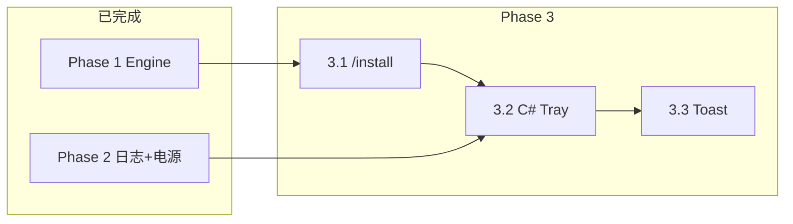

# Phase 3 Task Contract — 托盘 C# 化 + 安装器

**状态：** 3.1 / 3.2 / 3.3 已完成（2026-06-16）  
**父规划：** [`MIGRATION.md`](MIGRATION.md) § Phase 3  
**制定日期：** 2026-06-16  
**前置：** Phase 1 收尾完成；Phase 2（2.1–2.3）完成

---

## Execution Summary

| 项 | 内容 |
|----|------|
| **Task** | 降低部署摩擦（`/install`）并可选将托盘从 PowerShell 迁至 C#，**不**重写设置/日志查看器 |
| **Mode** | `STRICT`（按子阶段切片交付，每片 TDD + `Run-Tests.ps1` 全绿） |
| **推荐顺序** | **3.1 安装器** → **3.2 C# 托盘核心** → **3.3 托盘通知增强**（可选） |
| **基线策略 3A** | 未实施 3.2 前，**继续**使用 `lib/SmartGuard.Tray.ps1`（无回归要求） |

---

## 一、子阶段总览

| 子阶段 | 代号 | 目标 | 优先级 | 预估 |
|--------|------|------|--------|------|
| 3A | 基线 | PS 托盘 + PS 注册脚本（**当前生产态**） | — | 已完成 |
| **3.1** | 3C | `SmartGuard.Engine.exe /install` `/uninstall` | **高** | 小 |
| **3.2** | 3B-core | C# `SmartGuard.Tray.exe`：NotifyIcon + 读 `status.json` + 菜单对等 | 中 | 中 |
| **3.3** | 3B-toast | C# 托盘原生 Toast（或保留 PS 回退） | 低 | 小 |

```
3A 基线（PS 托盘）─── 生产默认，可随时回滚
        │
        ▼
3.1 /install ───────── 一条命令完成编译产物注册（不依赖手动找 ps1）
        │
        ▼
3.2 C# Tray ────────── 计划任务改指向 SmartGuard.Tray.exe；设置/日志仍调 PS
        │
        ▼
3.3 Toast（可选）───── 减少托盘对 PowerShell Toast 脚本的依赖
```

---

## 二、Goal（Phase 3 总目标）

1. **安装体验：** 用户以管理员运行 `SmartGuard.Engine.exe --install` 即可注册 Guardian + Tray 计划任务，无需记忆多个 ps1 路径。
2. **托盘演进（可选 3.2）：** 托盘进程改为 C# WinForms `NotifyIcon`，仍通过 `SmartGuard.status.json` / `SmartGuard.config.json` 与引擎通信。
3. **行为不回归：** 计划切换、暂停、通知、设置、日志查看等**用户可见能力**与 Phase 2 结束时不减。
4. **可回滚：** 任一子阶段均可退回 3A（PS 托盘 + `Register-*.ps1`）。

---

## 三、Non-Goals（整个 Phase 3 不做）

| 项 | 说明 |
|----|------|
| WPF 设置窗体 C# 重写 | 继续 `SmartGuard.Settings.ps1` + `.xaml` |
| 日志查看器 C# 重写 | 继续 `Presentation.LogViewer.ps1` |
| 引擎逻辑迁入托盘 | 守护循环仅在 `SmartGuard.Engine` |
| Windows Service | 仍用计划任务 + WinExe |
| self-contained 单文件发布 | 维持 net8.0 框架依赖（D4） |
| 全局热键 | MIGRATION 永久不做 |
| 移除 PowerShell 回退引擎 | `SmartGuard.Core.ps1` 保留 |
| 跨平台托盘 | 仅 Windows 10/11 |

---

## 四、现状审计（3A 基线）

### 4.1 部署链路

| 步骤 | 当前实现 | 痛点 |
|------|----------|------|
| 编译 | `scripts/Publish-Engine.ps1` | 需手动执行 |
| 注册 Guardian | `Register-SmartGuardTask.ps1`（管理员） | 分散、易忘 |
| 注册 Tray | `Register-TrayTask.ps1` | 启动 `powershell -Sta -File SmartGuard.Tray.ps1` |
| 一键 | `Setup-All.cmd` | 硬编码 `D:\Project\SmartGuard`；仍多步 |
| 安装脚本 | `lib/Install-SmartGuard.ps1` | 含编码修复，偏重 |

### 4.2 托盘（`lib/SmartGuard.Tray.ps1`）

| 能力 | 实现要点 |
|------|----------|
| 单实例 | `Enter-SingleInstanceMutex -Name 'Tray'` |
| 轮询 | `Timer` 5s → `Read-SmartGuardStatus` |
| 展示 | `Format-TrayTooltip` / `Format-TrayStatusLine` |
| 菜单 | 状态行、暂停/恢复、打开日志、设置、退出 |
| 暂停 | 写 `config.json` 的 `Paused` + `Write-SmartGuardLog` |
| 设置 | `Show-SmartGuardSettings`（WPF，PS） |
| 日志 | `Start-SmartGuardLogViewerProcess`（隐藏 PS） |
| 通知 | `Show-SmartGuardToast` + Balloon 回退 |
| 图标 | `lib/tray.ico` / `Create-TrayIcon.ps1` |

### 4.3 IPC 契约（冻结，3.x 不得破坏）

| 文件 | C# 类型 | 说明 |
|------|---------|------|
| `SmartGuard.status.json` | `StatusPayload` | 含 `notificationEvent` |
| `SmartGuard.config.json` | `GuardConfig` | 托盘只写 `Paused`（及设置窗体全量写） |

### 4.4 计划任务（当前）

| 任务名 | 执行体 | 权限 |
|--------|--------|------|
| `SmartGuard Guardian` | `bin\SmartGuard.Engine.exe` | 最高 |
| `SmartGuard Tray` | `powershell.exe -Sta -File lib\SmartGuard.Tray.ps1` | 用户 |

---

## Phase 3.1 Task Contract — `/install` 安装器（3C）

### 3.1.1 Goal

在 `SmartGuard.Engine.exe` 增加**命令行模式**，支持：

```powershell
SmartGuard.Engine.exe --install          # 或 /install
SmartGuard.Engine.exe --uninstall        # 或 /uninstall
SmartGuard.Engine.exe --root D:\path --install
```

安装结果与手动执行 `Register-SmartGuardTask.ps1` + `Register-TrayTask.ps1` **等价**。

### 3.1.2 技术决策（冻结）

| ID | 决策 | 选定值 |
|----|------|--------|
| I1 | 实现策略 | **编排现有 PS 脚本**（3.1 不重复 Task Scheduler API） |
| I2 | 提权 | 非管理员时 `runas` 自提升后重试（与 `Start-Core.ps1` 一致） |
| I3 | 入口 | `Program.cs` 解析 `--install`/`--uninstall` 后**不**进入 `GuardianLoop` |
| I4 | 退出码 | 成功 `0`；失败非 `0`；写 `SmartGuard.startup.log` |
| I5 | 依赖 | `Register-SmartGuardTask.ps1`、`Register-TrayTask.ps1` 相对 `--root` |
| I6 | 发布 | `/install` 前检查 `bin\SmartGuard.Engine.exe` 存在；可选 `--skip-publish` 跳过编译提示 |

### 3.1.3 文件级改动

| 文件 | 操作 |
|------|------|
| `src/.../Cli/InstallCommands.cs` | **新增** — 提权、调 ps1、日志 |
| `src/.../Cli/CommandLineParser.cs` | **新增** — 解析 install/uninstall/root |
| `src/.../Program.cs` | **修改** — 路由到 Install 或 Guardian |
| `tests/.../CommandLineParserTests.cs` | **新增** |
| `tests/.../InstallCommandsTests.cs` | **新增**（路径解析、参数构建，不真注册任务） |
| `README.md` | 增加 `--install` 快速开始 |

**不改：** `Register-*.ps1` 行为（仅被调用）

### 3.1.4 `/uninstall` 范围

- 删除计划任务：`SmartGuard Guardian`、`SmartGuard Tray`
- **不**删除配置文件、日志、exe
- 不杀正在运行的进程（文档说明可选手动 `Stop-Process`）

### 3.1.5 验收标准

| # | 项 | 验证 |
|---|-----|------|
| V1 | 管理员 `--install` 后两任务存在且指向正确 exe/ps1 | `Get-ScheduledTask` |
| V2 | 注销登录后 Guardian + Tray 自启 | 手动或重启 |
| V3 | 非管理员触发 UAC 后安装成功 | 目视 |
| V4 | `--uninstall` 后任务消失 | `Get-ScheduledTask` |
| V5 | 无参数仍进入守护循环 | 行为不变 |
| V6 | xUnit 新增 ≥4 | `Run-Tests.ps1` 全绿 |

### 3.1.6 回滚

继续使用 `Register-*.ps1`；`Program.cs` 路由可保留（无害）。

---

## Phase 3.2 Task Contract — C# 托盘核心（3B-core）

### 3.2.1 Goal

新增 **`src/SmartGuard.Tray/`**（`net8.0-windows` WinExe），计划任务改为启动 `bin/SmartGuard.Tray.exe`，实现与 PS 托盘**菜单级对等**：

- 状态 tooltip + 菜单首行
- 暂停/恢复（写 `Paused`）
- 打开日志 → **启动现有** `lib/Show-LogViewer.ps1`（隐藏 PS）
- 设置 → **启动现有** `SmartGuard.Settings.ps1`（WPF）
- 退出
- 5s 轮询 `status.json`
- 单实例 Mutex `Global\SmartGuard.Tray`

### 3.2.2 技术决策（冻结）

| ID | 决策 | 选定值 |
|----|------|--------|
| T1 | UI 框架 | **WinForms** `NotifyIcon` + `ContextMenuStrip`（与现托盘一致） |
| T2 | 共享契约 | 新建 **`SmartGuard.Contracts`** 类库，迁入 `StatusPayload`/`NotificationEvent`；Engine + Tray 引用 |
| T3 | 格式化 | C# `TrayStatusFormatter` 端口 `Format-TrayTooltip` / `Format-TrayStatusLine`（单测） |
| T4 | 配置读写 | Tray 只读+写 `Paused`；完整编辑仍走 PS 设置窗体 |
| T5 | 通知（3.2） | **仅 Balloon** `ShowBalloonTip`；Toast 留给 3.3 |
| T6 | 图标 | 读 `{root}/lib/tray.ico`；缺失时用 `SystemIcons.Shield` |
| T7 | DPI | `Application.SetHighDpiMode(PerMonitorV2)` |
| T8 | 任务注册 | `Register-TrayTask.ps1` 优先 `SmartGuard.Tray.exe`，不存在则回退 PS |

### 3.2.3 工程结构（目标）

```
src/
├── SmartGuard.Contracts/          # StatusPayload, NotificationEvent, 只读 GuardConfig 片段
├── SmartGuard.Engine/             # 引用 Contracts；GuardianLoop 不变
└── SmartGuard.Tray/               # WinExe；引用 Contracts
bin/
├── SmartGuard.Engine.exe
└── SmartGuard.Tray.exe            # dotnet publish 输出
scripts/
└── Publish-All.ps1                # 发布 Engine + Tray
```

### 3.2.4 文件级改动

| 文件 | 操作 |
|------|------|
| `src/SmartGuard.Contracts/*.cs` | **新增** — 从 Engine 抽出 IPC DTO |
| `src/SmartGuard.Tray/Program.cs` | **新增** |
| `src/SmartGuard.Tray/TrayApplicationContext.cs` | **新增** — 菜单、定时器 |
| `src/SmartGuard.Tray/TrayStatusFormatter.cs` | **新增** |
| `src/SmartGuard.Tray/ConfigStore.cs` | **新增** — 读写信 config（Paused） |
| `src/SmartGuard.Tray/StatusStore.cs` | **新增** — 读 status.json |
| `src/SmartGuard.Tray/ExternalToolLauncher.cs` | **新增** — 隐藏 PS 启动设置/日志 |
| `Register-TrayTask.ps1` | **修改** — 优先 Tray.exe |
| `scripts/Publish-Tray.ps1` | **新增** |
| `SmartGuard.slnx` | **修改** |
| `tests/SmartGuard.Tray.Tests/` | **新增** xUnit（Formatter、Status 解析） |
| `Tests/SmartGuard.Tests.ps1` | **扩展** — Tray 任务注册断言 |

**保留不动：** `lib/SmartGuard.Tray.ps1`（回退）、`SmartGuard.Settings.*`、LogViewer

### 3.2.5 菜单行为对照

| 菜单项 | PS 托盘 | C# 托盘 3.2 |
|--------|---------|-------------|
| 状态行（禁用） | `Format-TrayStatusLine` | `TrayStatusFormatter.FormatStatusLine` |
| 暂停/恢复 | 切换 `Paused` + 写日志 | 同；日志可 `FileLogger` 写一行 INFO 或调 PS `Write-SmartGuardLog` |
| 打开日志 | PS LogViewer | `powershell -WindowStyle Hidden -File Show-LogViewer.ps1` |
| 设置 | WPF PS | `powershell -Sta -File SmartGuard.Settings.ps1` |
| 双击图标 | 打开设置 | 同 |
| 退出 | `Application.Exit` | 同 |

### 3.2.6 验收标准

| # | 项 | 验证 |
|---|-----|------|
| V1 | 托盘 tooltip 与 PS 版字段一致 | 对比插电/电量/亮度/暂停 |
| V2 | 暂停后引擎下轮不切换计划 | 读日志 + status |
| V3 | 设置/日志从 C# 托盘可打开 | 手动 |
| V4 | 删除 `SmartGuard.Tray.exe` 时 Register 回退 PS | 单测读脚本内容 |
| V5 | Mutex 双开提示 | 第二次启动弹窗或静默退出 |
| V6 | Pester + xUnit 全绿 | `Run-Tests.ps1` |

### 3.2.7 回滚

1. `Register-TrayTask.ps1` 改回仅 PS（或删除 exe）
2. 重新 `--install` 或手动注册
3. `lib/SmartGuard.Tray.ps1` 无需改动

---

## Phase 3.3 Task Contract — 托盘通知增强（3B-toast，可选）

### 3.3.1 Goal

C# 托盘读取 `status.json` 的 `notificationEvent`，展示与 PS **等效**的 Toast 通知（计划切换、外部变更），减少 `Infrastructure.Toast.ps1` 依赖。

### 3.3.2 技术决策（冻结）

| ID | 决策 | 选定值 |
|----|------|--------|
| N1 | 首选 API | **Windows App SDK Toast** 或 **WinRT `Windows.UI.Notifications`**（需 AUMID 注册） |
| N2 | 回退 | Toast 失败 → `NotifyIcon.ShowBalloonTip`（与 PS 一致） |
| N3 | 去重 | 按 `notificationEvent.id` 去重（端口 `Test-ShouldShowStatusNotification`） |
| N4 | AUMID | 复用 `Tools.SmartGuard.Guardian`（`Get-SmartGuardToastAppId`） |

### 3.3.3 验收标准

| # | 项 |
|---|-----|
| V1 | 计划切换时 Toast 标题/正文与 Phase 2 一致 |
| V2 | 同一 `event.id` 不重复弹 |
| V3 | Toast 不可用时 Balloon 仍工作 |

### 3.3.4 Non-Goals

- 不删除 `Infrastructure.Toast.ps1`（PS 托盘回退仍需要）

---

## 五、跨阶段依赖



- **3.1 可独立于 3.2** 交付（推荐先 ship）
- **3.2 依赖** Contracts 抽取（可与 3.2 同 PR，不单独 ship）
- **3.3 仅依赖 3.2**

---

## 六、测试策略

| 子阶段 | 测试类型 | 要点 |
|--------|----------|------|
| 3.1 | xUnit | `CommandLineParser`、`InstallCommandLineBuilder`（不触网/不真注册） |
| 3.2 | xUnit + Pester | `TrayStatusFormatter`；脚本含 `SmartGuard.Tray.exe` |
| 3.3 | xUnit + 手动 | 通知去重逻辑单测；Toast 手动 |

**纪律：** 每子阶段 Red → Green → `Run-Tests.ps1` 贴输出后再标 MIGRATION 完成。

---

## 七、风险与缓解

| 风险 | 缓解 |
|------|------|
| `/install` 调 PS 仍依赖 ExecutionPolicy | 安装器用 `-ExecutionPolicy Bypass` |
| C# 托盘 + PS 设置双进程 | 保持现有模式；设置保存后 Tray 轮询刷新 |
| Contracts 抽取破坏 Engine | 先 xUnit 绿灯再迁 DTO；Engine 测试覆盖序列化 |
| Toast AUMID 注册失败 | 3.3 保留 Balloon；文档写注册表说明 |
| `Setup-All.cmd` 硬编码路径 | 3.1 文档推荐 `--install`；可选后续改 Setup 调 exe |

---

## 八、推荐实施顺序（给用户）

1. **先做 3.1**：收益最大、改动面最小，不改变托盘运行时  
2. **评估是否需要 3.2**：若 PS 托盘稳定可长期维持 3A  
3. **需要更低托盘开销/更少 PS 依赖时做 3.2**  
4. **3.3 仅在 3.2 完成且 Toast 体验不足时做**

---

## 九、文档与 MIGRATION 更新清单

每子阶段完成后：

- [ ] `MIGRATION.md` § Phase 3 表勾选对应行
- [ ] `README.md` 快速开始同步
- [ ] `lib/README-DEPLOY.txt` 同步
- [ ] 本文件对应子阶段标 **已完成**
- [ ] 变更记录追加日期

---

## 十、变更记录

| 日期 | 变更 |
|------|------|
| 2026-06-16 | Phase 3 总 Contract 落盘；拆 3.1 / 3.2 / 3.3 |
| 2026-06-16 | Phase 3.2：`SmartGuard.Tray.exe` + `SmartGuard.Contracts`；`Register-TrayTask` 优先 exe |
| 2026-06-16 | Phase 3.3：C# 托盘 WinRT Toast + Balloon 回退；AUMID `Tools.SmartGuard.Guardian` |

---

## 附录 A：3.1 命令行草图

```
SmartGuard.Engine.exe [--root PATH] [--install | --uninstall | (default: run guardian)]
```

`InstallCommands.RunInstall(root)` 伪代码：

1. 若 !IsAdministrator → `Start-Process -Verb RunAs` 自身带 `--install`
2. `powershell -NoProfile -ExecutionPolicy Bypass -File {root}\Register-SmartGuardTask.ps1`
3. `powershell -NoProfile -ExecutionPolicy Bypass -File {root}\Register-TrayTask.ps1`
4. 写 startup.log 成功/失败

---

## 附录 B：3.2 与 PS 托盘共存策略

| 时期 | Guardian 任务 | Tray 任务 |
|------|---------------|-----------|
| 仅 3.1 | Engine.exe | PS Tray.ps1 |
| 3.2 上线 | Engine.exe | **Tray.exe**（优先） |
| 回滚 | Engine.exe | PS Tray.ps1 |

两版托盘**不要同时**注册；`--install` 始终以当前 `Register-TrayTask.ps1` 逻辑为准。

---

## 附录 C：3A 明确范围（无开发工作）

**3A = 维持现状：**

- 托盘：`lib/SmartGuard.Tray.ps1`
- 部署：`Register-*.ps1` / `Setup-All.cmd`
- 不创建 `SmartGuard.Tray` 项目

用于回滚命名与文档对照，**不是待办切片**。
