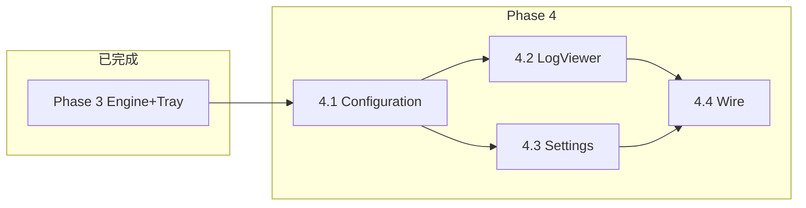

# Phase 4 Task Contract — 设置 / 日志查看器 C# 化

**状态：** Phase 4 **已完成**（4.1–4.4，2026-06-16）  
**父规划：** [`MIGRATION.md`](MIGRATION.md) § Phase 4  
**制定日期：** 2026-06-16  
**前置：** Phase 3（3.1–3.3）已完成；生产态为 `Engine.exe` + `Tray.exe`，设置/日志仍调 PowerShell

---

## Execution Summary

| 项 | 内容 |
|----|------|
| **Task** | 将 **WPF 设置窗体** 与 **WinForms 日志查看器** 从 PowerShell 迁至 C#，消除托盘对隐藏 `powershell.exe` 子进程的依赖 |
| **Mode** | `STRICT`（按子阶段切片交付；每片 Red → Green → `Run-Tests.ps1` 全绿；UI 切片附加手动验收） |
| **推荐顺序** | **4.1 共享配置库** → **4.2 日志查看器** → **4.3 设置窗体** → **4.4 托盘集成与发布** |
| **基线策略 4A** | Phase 4 未上线前，继续 `SmartGuard.Settings.ps1` + `Show-LogViewer.ps1`（无回归要求） |

---

## Task Contract Summary

| 项 | 内容 |
|----|------|
| **Goal** | 用户从 C# 托盘打开的设置、日志与现 PS 版**行为对等**；配置/日志文件格式不变 |
| **In scope** | 共享 `GuardConfig` 读写与校验；`SmartGuard.LogViewer.exe`；`SmartGuard.Settings.exe`；托盘启动链改指向 exe；发布脚本扩展 |
| **Out of scope** | 设置 UI 重设计；日志级别着色/过滤；移除 PS 回退；Windows Service；self-contained 发布 |
| **Acceptance** | 各子阶段验收表 V1–Vn 全过；`Run-Tests.ps1` 全绿；手动点托盘「设置」「打开日志」路径验收 |
| **Rollback** | 删除 `bin\SmartGuard.Settings.exe` / `SmartGuard.LogViewer.exe` 即回退 PS；无需改 config/status |

---

## Risk Note

| 焦点 | 说明 | 缓解 |
|------|------|------|
| 配置写回 | 设置保存须保留 GUID、LogMaxBytes 等**未暴露于 UI 的字段** | 4.1 用「读全量 JSON → 改 UI 字段 → 写回」策略；单测覆盖 |
| 开机自启 | `AutoStartEnabled` 联动计划任务 Enable/Disable | 端口 `Infrastructure.AutoStart.ps1`；集成测试 mock schtasks 或 Pester 断言命令构造 |
| WPF 宿主 | Tray 为 WinForms，不宜同进程混载 WPF | **独立 `SmartGuard.Settings.exe` 进程**（与现 PS 延迟打开语义一致） |
| 日志尾随 | 增量追加 + `WM_SETREDRAW` 防闪烁 | 端口 `Presentation.LogViewer.ps1` 算法；单测 `LogTailReader` |
| 双实例 | LogViewer Mutex `Global\SmartGuard.LogViewer` | C# `SingleInstanceGuard` 复用 Contracts |
| Engine 配置耦合 | `GuardConfig` 现仅在 Engine 项目 | 4.1 抽到 `SmartGuard.Configuration`，Engine/Tray/Settings/LogViewer 统一引用 |

---

## 一、子阶段总览

| 子阶段 | 代号 | 目标 | 优先级 | 预估 |
|--------|------|------|--------|------|
| 4A | 基线 | PS 设置 + PS 日志（**当前生产态**） | — | 已完成 |
| **4.1** | 4D-config | 共享配置库：读写、校验、暂停日志、自启控制 | **高** | 中 |
| **4.2** | 4D-log | `SmartGuard.LogViewer.exe`：实时尾随、单实例 | **高** | 中 |
| **4.3** | 4D-settings | `SmartGuard.Settings.exe`：端口 WPF XAML + 保存副作用 | **高** | 大 |
| **4.4** | 4D-wire | 托盘/Publish/回退脚本对接 | 中 | 小 |

```
4A 基线（PS 设置/日志）─── 可随时回滚
        │
        ▼
4.1 Configuration ─────── GuardConfig 统一；Validator；AutoStart；替代 Tray 局部 ConfigStore
        │
        ▼
4.2 LogViewer.exe ─────── 独立 WinExe；Tray 不再 spawn 隐藏 PowerShell
        │
        ▼
4.3 Settings.exe ──────── 端口 SmartGuard.Settings.xaml；保存写 config + 自启 + 日志
        │
        ▼
4.4 集成发布 ──────────── ExternalToolLauncher 优先 exe；Publish-All；文档与测试
```

---

## 二、Goal（Phase 4 总目标）

1. **去掉壳层 PowerShell 依赖：** 托盘菜单「设置」「打开日志」不再启动 `powershell.exe`。
2. **行为不回归：** 滑块范围、校验错误文案、保存后托盘刷新、日志尾随与状态栏信息与 Phase 3 结束时一致。
3. **契约冻结：** `SmartGuard.config.json` 字段名与默认值不变；日志仍为纯文本（含 `[INFO]`/`[WARN]` 等标签）。
4. **可回滚：** 删除对应 exe 或保留脚本回退路径，与 Phase 3 Tray 回退策略一致。

---

## 三、Non-Goals（整个 Phase 4 不做）

| 项 | 说明 |
|----|------|
| 设置 UI 视觉重设计 | 端口现有 `lib/SmartGuard.Settings.xaml`，不引入新设计系统 |
| 日志级别着色 / 过滤 UI | Phase 2.1 已标注为可选；本阶段仅保证新格式可读 |
| 删除 PS 设置/日志文件 | `SmartGuard.Settings.ps1`、`Show-LogViewer.ps1` 保留作回退 |
| 删除 `SmartGuard.Core.ps1` / PS 托盘 | 永久回退链保留 |
| 将设置嵌入 Tray 进程 | 独立 exe，避免 WinForms/WPF 同进程 STA 冲突 |
| Windows Service / 全局热键 | 与 MIGRATION 一致，不做 |
| self-contained 单文件 | 维持 net8.0 框架依赖（D4） |
| 重写部署编码修复脚本 | `Bootstrap-ForceRepair.ps1` 等不在本阶段动刀 |

---

## 四、现状审计（4A 基线）

### 4.1 设置（WPF + PowerShell）

| 能力 | 现实现 | 路径 |
|------|--------|------|
| UI 定义 | Fluent 风格 WPF XAML | `lib/SmartGuard.Settings.xaml` |
| 代码后置 | `XamlReader.Parse` + `FindName` 绑定 | `lib/SmartGuard.Settings.ps1` |
| 控件 | 5 滑块 + 3 开关（暂停/通知/自启） | XAML `sld*` / `tgl*` |
| 校验 | `Test-SmartGuardConfigValues` | `lib/layers/Infrastructure.Config.ps1` |
| 保存 | 写 config + 暂停日志 + 自启任务 | `Invoke-SmartGuardSettingsSave` |
| 托盘回调 | `OnSaved` 更新暂停菜单与 tooltip | `lib/SmartGuard.Tray.ps1` |
| C# 托盘入口 | 隐藏 PS | `ExternalToolLauncher.OpenSettings` → `SmartGuard.Settings.ps1` |

**滑块与配置映射（须保持）：**

| UI 控件 | 配置字段 | 换算 |
|---------|----------|------|
| `sldBalanced` | `BalancedThresholdSec` | 分钟 × 60，最小 1 分钟 → ≥60s |
| `sldSaver` | `PowerSaverThresholdSec` | 分钟 × 60，最小 2 分钟 |
| `sldBattery` | `LowBatteryPercent` | 直接 |
| `sldPoll` | `CheckIntervalSec` | 直接 |
| `sldBrightMs` | `BrightnessRestoreMs` | 直接 |
| `tglPaused` | `Paused` | 直接 |
| `tglNotify` | `NotifyOnPlanChange` | 默认 true |
| `tglAutoStart` | `AutoStartEnabled` | 默认 true |

### 4.2 日志查看器（WinForms + PowerShell）

| 能力 | 现实现 | 路径 |
|------|--------|------|
| 启动 | 隐藏 PS 进程 | `lib/Show-LogViewer.ps1` |
| 单实例 | Mutex `LogViewer` | `Enter-SingleInstanceMutex` |
| 窗体 | RichTextBox + StatusStrip | `lib/layers/Presentation.LogViewer.ps1` |
| 刷新 | 2s Timer | `Update-SmartGuardLogViewerForm` |
| 读文件 | `FileShare.ReadWrite` 增量 offset | `Read-LogFileTextFromOffset` |
| 尾随 | 用户滚轮/方向键后暂停尾随，回到底部恢复 | `FollowTail` 状态机 |
| 防闪烁 | `WM_SETREDRAW` | `LogViewerRedraw` |
| 日志路径 | `config.LogFile` + fallback `SmartGuard.startup.log` | `Start-SmartGuardLogViewerApp` |
| C# 托盘入口 | 隐藏 PS | `ExternalToolLauncher.OpenLogViewer` |

### 4.3 已有 C# 资产（可复用）

| 资产 | 位置 | Phase 4 用法 |
|------|------|--------------|
| `GuardConfig` 模型 | `src/SmartGuard.Engine/Config/GuardConfig.cs` | **迁至** `SmartGuard.Configuration` |
| `ConfigStore`（仅 Paused） | `src/SmartGuard.Tray/StatusStore.cs` | 由共享库替代 |
| `SingleInstanceGuard` | `src/SmartGuard.Contracts` | LogViewer / Settings 复用 |
| `RootResolver` | Tray / Engine Cli | 抽到共享或 Contracts |
| `PauseGuardMessages` | `src/SmartGuard.Tray/TrayStatusFormatter.cs` | 迁至 Configuration 或共享 |

---

## 五、已批准技术决策（待你确认）

| ID | 决策 | 选定值 | 理由 |
|----|------|--------|------|
| P4-D1 | UI 目标框架 | **net8.0-windows10.0.17763.0** | 与 Tray 一致；WinRT/高 DPI 已验证 |
| P4-D2 | 设置 UI | **WPF WinExe** `SmartGuard.Settings` | 直接端口现有 XAML |
| P4-D3 | 日志 UI | **WinForms WinExe** `SmartGuard.LogViewer` | 与现实现一致，复杂度低 |
| P4-D4 | 配置共享 | 新类库 **`SmartGuard.Configuration`** | 避免 Contracts 膨胀；Engine/Tray/Settings/LogViewer 共用 |
| P4-D5 | 进程模型 | Settings / LogViewer **独立 exe**，Tray `Process.Start` | 避免 WinForms 宿主 WPF；对齐现「日志独立进程」 |
| P4-D6 | 配置持久化 | **读全量 JSON → 修改 → 写回**（保留未知字段） | 防止 UI 未绑定字段丢失 |
| P4-D7 | 自启控制 | 端口 PS：`Enable-ScheduledTask` / `Disable-ScheduledTask`；缺失任务时调 `Register-*.ps1` | 与现行为一致，不引入新安装语义 |
| P4-D8 | 回退 | `ExternalToolLauncher` **优先 exe，不存在则 PS** | 与 `Register-TrayTask` 策略一致 |
| P4-D9 | Mutex 名 | `Global\SmartGuard.LogViewer`；`Global\SmartGuard.Settings` | 对齐 PS 语义（Settings 可选：允许多开则仅 LogViewer 强制单实例） |
| P4-D10 | 发布 | `scripts/Publish-All.ps1` 增加 Settings + LogViewer | 一键产出 `bin\` 四 exe |

**待你拍板的一项：**

| ID | 问题 | 建议 |
|----|------|------|
| P4-O1 | Settings 是否单实例？ | **建议单实例**（重复打开聚焦已有窗口或提示「设置已打开」），与 LogViewer 一致 |

---

## 六、目标工程结构

```
src/
├── SmartGuard.Contracts/          # 已有：StatusPayload、Mutex
├── SmartGuard.Configuration/      # 新增：GuardConfig、Validator、Repository、AutoStartService
├── SmartGuard.Engine/             # 改：引用 Configuration，删除本地 GuardConfig
├── SmartGuard.Tray/               # 改：引用 Configuration；ExternalToolLauncher 优先 exe
├── SmartGuard.LogViewer/          # 新增：WinForms WinExe
└── SmartGuard.Settings/           # 新增：WPF WinExe（嵌入或链接现有 xaml）

bin/
├── SmartGuard.Engine.exe
├── SmartGuard.Tray.exe
├── SmartGuard.LogViewer.exe       # 新增
└── SmartGuard.Settings.exe        # 新增

tests/
├── SmartGuard.Configuration.Tests/
├── SmartGuard.LogViewer.Tests/
└── SmartGuard.Settings.Tests/     # 以 Validator/绑定逻辑为主；UI 手动验收

lib/
├── SmartGuard.Settings.ps1        # 保留回退
├── Show-LogViewer.ps1             # 保留回退
└── SmartGuard.Settings.xaml       # 源样式；Build 时复制到 Settings 项目或共享链接
```

---

## Phase 4.1 Task Contract — 共享配置库（4D-config）

### 4.1.1 Goal

抽取并统一配置访问，供 Engine、Tray、Settings、LogViewer 使用；消除 Tray 内 `JsonNode` 局部读写与 Engine `GuardConfig` 重复。

### 4.1.2 文件级改动

| 文件 | 操作 |
|------|------|
| `src/SmartGuard.Configuration/GuardConfig.cs` | **迁入**自 Engine |
| `src/SmartGuard.Configuration/GuardConfigValidator.cs` | **新增** — 端口 `Test-SmartGuardConfigValues` |
| `src/SmartGuard.Configuration/GuardConfigRepository.cs` | **新增** — Load/Save/UpdatePaused；保留未知 JSON 键 |
| `src/SmartGuard.Configuration/SettingsSnapshotMapper.cs` | **新增** — 端口 `New-ConfigFromTraySettings` |
| `src/SmartGuard.Configuration/AutoStartService.cs` | **新增** — 端口 `Set-SmartGuardAutoStart` |
| `src/SmartGuard.Configuration/PauseGuardMessages.cs` | **迁入**自 Tray |
| `src/SmartGuard.Engine/**` | **改** — 引用 Configuration |
| `src/SmartGuard.Tray/StatusStore.cs` | **改** — Config 部分委托 Repository |
| `tests/SmartGuard.Configuration.Tests/` | **新增** |

### 4.1.3 验收标准

| # | 项 | 验证 |
|---|-----|------|
| V1 | Validator 与 PS 错误文案一致 | xUnit 对照表 |
| V2 | Save 后未编辑字段不丢失 | 单测：含额外 JSON 键 |
| V3 | Engine 测试仍全绿 | `Run-Tests.ps1` |
| V4 | AutoStart `NeedsUpdate` 逻辑 | 端口 Pester 4 例 |

---

## Phase 4.2 Task Contract — 日志查看器（4D-log）

### 4.2.1 Goal

新增 `SmartGuard.LogViewer.exe`：2s 刷新、增量尾随、单实例、状态栏；托盘「打开日志」优先启动 exe。

### 4.2.2 技术决策（冻结）

| ID | 决策 | 选定值 |
|----|------|--------|
| L1 | UI | WinForms `RichTextBox` + `StatusStrip` |
| L2 | 刷新间隔 | **2000ms**（与 PS 一致） |
| L3 | 字体 | Consolas 10pt |
| L4 | 窗口标题 | `智能电源守护 - 日志（实时）` |
| L5 | 命令行 | `--root PATH`（与 Tray 一致） |

### 4.2.3 文件级改动

| 文件 | 操作 |
|------|------|
| `src/SmartGuard.LogViewer/Program.cs` | **新增** |
| `src/SmartGuard.LogViewer/LogViewerForm.cs` | **新增** |
| `src/SmartGuard.LogViewer/LogTailReader.cs` | **新增** — 端口 offset 读与 fallback 合并 |
| `src/SmartGuard.LogViewer/RichTextBoxRedraw.cs` | **新增** — 端口 `LogViewerRedraw` |
| `src/SmartGuard.Tray/Infrastructure.cs` | **改** — `OpenLogViewer` 优先 exe |
| `scripts/Publish-LogViewer.ps1` | **新增** |
| `tests/SmartGuard.LogViewer.Tests/` | **新增** — TailReader、AtTail 检测 |

### 4.2.4 验收标准

| # | 项 | 验证 |
|---|-----|------|
| V1 | 引擎写日志时查看器自动追加 | 手动：开 LogViewer → 触发心跳 |
| V2 | 上滚后停止尾随，回底部恢复 | 手动 |
| V3 | 二次启动提示「日志窗口已在运行」 | 手动 |
| V4 | 删除 exe 时 Tray 回退 PS | Pester 读 `Infrastructure.cs` |
| V5 | xUnit + Pester 全绿 | `Run-Tests.ps1` |

---

## Phase 4.3 Task Contract — 设置窗体（4D-settings）

### 4.3.1 Goal

新增 `SmartGuard.Settings.exe`：加载现有 XAML、绑定控件、校验、保存副作用（config + 暂停日志 + 自启）；托盘双击/菜单「设置」优先启动 exe。

### 4.3.2 技术决策（冻结）

| ID | 决策 | 选定值 |
|----|------|--------|
| S1 | XAML | **复用** `lib/SmartGuard.Settings.xaml`（项目内 `Linked` 或构建时复制） |
| S2 | 绑定方式 | Code-behind `FindName`（与 PS 一致，降低迁移风险） |
| S3 | 窗口 | `ShowDialog` 模态；Topmost 打开期间 true |
| S4 | 保存日志 | 暂停切换时写 `[INFO]` 行到 `LogFile` | 端口 `Get-PauseGuardLogMessage` |
| S5 | 命令行 | `--root PATH` |

### 4.3.3 文件级改动

| 文件 | 操作 |
|------|------|
| `src/SmartGuard.Settings/SmartGuard.Settings.csproj` | **新增** — `UseWPF` |
| `src/SmartGuard.Settings/SettingsWindow.xaml` | **链接** 现有 xaml |
| `src/SmartGuard.Settings/SettingsWindow.xaml.cs` | **新增** — 端口 `Show-SmartGuardSettings` 逻辑 |
| `src/SmartGuard.Settings/Program.cs` | **新增** |
| `src/SmartGuard.Tray/Infrastructure.cs` | **改** — `OpenSettings` 优先 exe |
| `scripts/Publish-Settings.ps1` | **新增** |
| `tests/SmartGuard.Settings.Tests/` | **新增** — Mapper、加载滑块初始值 |

### 4.3.4 菜单行为对照

| 行为 | PS 设置 | C# 设置 4.3 |
|------|---------|-------------|
| 取消 | 不写盘 | 同 |
| 保存校验失败 | MessageBox 警告 | 同文案 |
| 保存成功 | 写 config + 自启 + 日志 | 同 |
| 托盘刷新 | `OnSaved` 回调 | Tray 5s 轮询 + 可选进程退出码 0（无需 IPC） |

### 4.3.5 验收标准

| # | 项 | 验证 |
|---|-----|------|
| V1 | 各滑块初值与 config 一致 | 手动 + 单测 Mapper |
| V2 | 非法阈值弹出与 PS 相同错误 | 手动 |
| V3 | 切换「开机自启」后计划任务 Enable/Disable | 手动 `schtasks` |
| V4 | 切换「暂停守护」后引擎下轮不切换计划 | 读日志 + status |
| V5 | 删除 exe 时 Tray 回退 PS | Pester |
| V6 | `Run-Tests.ps1` 全绿 | 自动化 |

---

## Phase 4.4 Task Contract — 集成与发布（4D-wire）

### 4.4.1 Goal

统一发布、更新文档、扩展 Pester 断言；Phase 4 对外可交付。

### 4.4.2 文件级改动

| 文件 | 操作 |
|------|------|
| `scripts/Publish-All.ps1` | **改** — Engine + Tray + LogViewer + Settings |
| `SmartGuard.slnx` | **改** — 加入新项目 |
| `Run-Tests.ps1` | **改** — 跑 Configuration / LogViewer / Settings 测试 |
| `docs/MIGRATION.md` | **改** — Phase 4 状态表 |
| `README.md` | **改** — bin 四 exe 说明 |
| `Tests/SmartGuard.Tests.ps1` | **扩展** — 回退路径断言 |

### 4.4.3 验收标准

| # | 项 |
|---|-----|
| V1 | `Publish-All.ps1` 产出四个 exe |
| V2 | 全新机器：`--install` + 托盘四项菜单均不依赖 powershell（exe 存在时） |
| V3 | 文档与测试数量同步 |

---

## 七、测试策略

| 类型 | 位置 | 重点 |
|------|------|------|
| xUnit | `SmartGuard.Configuration.Tests` | Validator、Repository  round-trip、Mapper |
| xUnit | `SmartGuard.LogViewer.Tests` | `LogTailReader`、offset 追加、at-tail 判定 |
| xUnit | `SmartGuard.Settings.Tests` | 分钟↔秒换算、默认值 |
| Pester | `SmartGuard.Tests.ps1` | 启动器回退、xaml 仍存在于 lib |
| 手动 | 每子阶段 | **必须从托盘点击**「设置」「打开日志」完成 UI 验收（DevGuard UI 路径要求） |

**TDD 纪律：** 先写失败测试（Validator、TailReader、Mapper）→ 最小实现 → `Run-Tests.ps1` 全绿 → 再 UI 接线。

---

## 八、回滚方案

1. 从 `bin\` 删除 `SmartGuard.Settings.exe` 和/或 `SmartGuard.LogViewer.exe`
2. 无需改计划任务（托盘 exe 内启动器自动回退 PS）
3. 或整体回退：删除 `SmartGuard.Tray.exe`，重新 `--install`（回到 PS 托盘 + PS 设置/日志）
4. `SmartGuard.config.json` / 日志文件**无需迁移**

---

## 九、跨阶段依赖



- **4.2 与 4.3 可并行**（均依赖 4.1），但建议 **先 LogViewer 后 Settings**（风险递增）。
- **4.4 依赖 4.2 + 4.3**。

---

## 十、官方平台约束（摘要）

| 约束 | 来源 | Phase 4 影响 |
|------|------|--------------|
| WPF + WinForms 需 STA | .NET Desktop | 各 WinExe 独立 `[STAThread]` |
| 计划任务 API | Windows Task Scheduler | AutoStart 用 `schtasks` 或 `Microsoft.Win32.TaskScheduler`（优先与 PS 相同 schtasks 子进程以降低风险） |
| 高 DPI | Windows 10+ | `Application.SetHighDpiMode(PerMonitorV2)` |
| 日志文件共享读 | .NET IO | `FileShare.ReadWrite` 与 PS 一致 |

---

## 十一、批准前请确认

- [ ] 子阶段顺序 **4.1 → 4.2 → 4.3 → 4.4** 是否同意？
- [ ] 技术决策 **P4-D1–D10** 是否批准？（尤其 **独立 exe** 而非 Tray 内嵌 WPF）
- [ ] **P4-O1** Settings 是否单实例？
- [ ] 是否同意 **不重设计 UI**，仅端口？
- [ ] 批准后首片实施：**4.1 Configuration**（不动 UI）

---

## 十二、变更记录

| 日期 | 变更 |
|------|------|
| 2026-06-16 | Phase 4 规划起草；DevGuard STRICT 模式 Task Contract |
| 2026-06-16 | Phase 4.1：`SmartGuard.Configuration`；Engine/Tray 迁移；10 项 xUnit |
| 2026-06-16 | Phase 4.2：`SmartGuard.LogViewer.exe`；托盘优先启动 exe |
| 2026-06-16 | Phase 4.3：`SmartGuard.Settings.exe`；`SettingsSaveCoordinator` |
| 2026-06-16 | Phase 4.4：`Publish-All.ps1` 四 exe；托盘全面 C# 启动链 |

---

## 附录 A：配置字段完整清单（兼容契约）

`ActivePlanGUID`, `BalancedPlanGUID`, `PowerSaverPlanGUID`, `BalancedThresholdSec`, `PowerSaverThresholdSec`, `LowBatteryPercent`, `CheckIntervalSec`, `BrightnessRestoreMs`, `LogFile`, `Paused`, `LogMaxBytes`, `BrightnessRetryCount`, `BrightnessRetryDelayMs`, `NotifyOnPlanChange`, `HeartbeatIntervalMin`, `AutoStartEnabled`

---

## 附录 B：Phase 3 Non-Goal 废止说明

Phase 3 明确「不重写设置/日志」。**Phase 4 经你批准后**，上述 Non-Goal 仅对 Phase 3 有效；本 Phase 4 Contract 取代该限制，但不自动删除 PS 回退实现。
